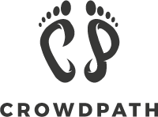

# CrowdPath

## Open Hack Gbg 2017 - Hacking for Humanity
With this project we try to contribute to two cases from the Hack:

## 1. Just Arrived - 
 
​ ​Crowdsourced​ ​Knowledge 
 
Just​ ​Arrived​ ​-​ ​We​ ​guide,​ ​empower​ ​and​ ​connect
The ​mission ​of ​Just ​Arrived ​is ​enrich ​and ​empower ​the ​labor ​market ​by ​guiding, ​empowering ​and
connecting ​foreign-born ​competence ​with ​the ​staffing ​needs ​of ​Swedish ​companies. ​We ​envision
ourselves ​being ​the ​most ​trusted ​go ​to-place ​for ​all ​foreign-born ​in ​need ​of ​work. ​Built ​up ​by ​over
200 ​volunteers, ​representing ​60 ​companies ​and ​authorities ​in ​Sweden, ​we ​now ​work ​with ​over ​100
customers ​and ​have ​users ​from ​over ​100 ​countries, ​speaking ​more ​than ​80 ​different ​languages.
Our​ ​challenge

On ​a ​daily ​basis ​we ​come ​in ​contact ​with ​tons ​of ​people ​and ​many ​(if ​not ​all) ​of ​them ​face ​the ​same
challenge: How ​can ​I ​find ​more ​information ​and/or ​a ​guide ​on ​how ​I ​can ​get ​my ​first ​job ​i ​Sweden? Today
institutions ​provide ​the ​information ​required ​to ​get ​a ​job, ​end-to-end. ​You ​can ​find ​bits ​of
information ​on ​different ​sites ​provided ​by ​Arbetsförmedlingen, ​Skatteverket, ​Migrationsverket,
Försäkringskassan, ​etc. ​Thing ​is, ​they ​all ​provide ​different ​interfaces ​and ​can ​be ​very ​hard ​to ​find
(and ​not ​all ​of ​them ​are ​even ​up ​to ​date!).

The​ ​mission:​ ​a​ ​crowdsourced​ ​knowledge​ ​base
We ​all ​love ​and ​use ​services ​such ​as Wikipedia ​and Stack ​Overflow ​They’ve ​tapped ​into ​the
knowledge ​of ​many ​and ​made ​information ​accessible ​to ​hundreds ​of ​millions ​of ​people ​across ​the
world. ​Literally ​changing ​the ​landscape ​of ​information ​access. ​Could ​a ​knowledge ​base ​for
jobseekers ​be ​created?

Mission ​1: Could ​the ​best ​guides ​and ​information ​be ​curated ​by ​harvesting ​insights ​from ​the ​many?
Mission ​2: Also, ​is ​it ​possible ​to ​curate ​the ​best ​information ​from ​different ​authorities ​and
institutions ​and ​present ​it ​in ​one ​place?

Bonus: Conceptualize ​how ​can ​users ​rate/vote/give ​feedback ​on ​content?
Create ​the ​go ​to-place

We ​strongly ​believe ​that ​by ​guiding ​and ​empowering ​users ​with ​knowledge, ​they ​will ​be ​able ​to ​find
their ​first ​job ​opportunity ​on ​their ​own, ​or ​through ​us, ​and ​much ​faster ​than ​by ​any ​other ​means.
Can ​you ​create ​an ​application ​that ​can ​becomes ​the ​goto ​place ​to ​find ​qualitative, ​and ​up ​to ​date,
guides ​and ​information ​to ​all ​jobseekers. ​Provide ​users ​with ​a ​“recipe” ​for ​how ​to ​get ​into ​the
Swedish ​labor ​market, ​and ​in ​the ​future, ​other ​labour ​market(s).
Constraints

We ​all ​believe ​in ​the ​web. ​It’s ​open, ​searchable, ​linkable ​and ​accessible ​in ​a ​way ​that ​native ​apps,
frankly, ​are ​not. ​Since ​we ​want ​to ​get ​this ​information ​in ​the ​hands ​of ​the ​many ​we ​would ​very ​much
like ​to ​see ​this ​developed ​as ​a ​web ​application, ​we ​don’t ​want ​users ​to ​be ​left ​out ​just ​because ​they
are ​on ​“the ​wrong ​platform”.
We’re ​really ​interested ​to ​see ​what ​you ​can
build!

Jacob ​Burenstam, ​CTO ​& ​Co-founder
#frontend ​#backend ​#db ​#webdev ​#problemsolving
#wiki-ish

## 2. Individuell människohjälp (IM)

component but the focus is mainly on live interaction between volunteers and newly arrived migrants looking for jobs
in Sweden.

The platform might also involve links to companies and other organizations wishing to publish adverts about vacancies
and internships as a way of getting in touch with interesting candidates.
It is important that the digital platform is easy to manage and support.

As a second step the digital platform might be extended to connect with other networks working towards the same
goal as IM. For example, in the Opportunity Guide by Opportunity Day http://opportunityday.se/opportunity-guide/
Challenge and problem statement

In Sweden we work with shedding light on and strengthening the voices of people who are excluded. Racism,
discrimination and flaws in the assistance that newly arrived migrants receive, can lead to exclusion and vulnerability
among people born outside of Sweden. In this group the unemployment rate is much higher than among native
Swedes. In Sweden, IM focuses on integration and engagement. We want to improve the opportunities for people to
become included in society, and at the same time fight exclusion. Our work is about encounters between people.
IM believes in a strong civil society and therefore encourages voluntary work. We have local offices in Gothenburg,
Malmo, Stockholm, Ume ¨ a and Vrigstad with more extensive activities, but the organization is represented in other ˚
parts of Sweden too.

See more information on our webpage about the integration activities we offer as well as our campaign ”The New
Country” - about perspectives on integration; https://manniskohjalp.se/ims-integrationsarbete https://manniskohjalp.se/integration/detnya-landet

Goals (what are your goals for the future with this challenge, what would you like to achieve)
Our goal for the future with this challenge is to create a well-functioning digital, voluntary-based meeting place for
the exchange of knowledge and experience, tips and advice that facilitate the entry of newly arrived migrants in the
Swedish labor market.

We also hope that this challenge will enhance cooperation between us and other players working towards integration
of newly arrived migrants to the Swedish labor market and in society in general. In addition, we hope that it will serve
as a model for other IM activities, resulting in more digital opportunities for IM volunteers and practically anyone
wanting to contribute their time through engagement in a civil society.
Who is the end user? (Who will be the one using the app/tool/etc)
Newly arrived migrants and others with a foreign background, volunteers as well as companies, organizations and
networks and other actors on the Swedish labor market.

OPTIONAL: Requirements/criterias (e.g. must be in English, must run on Android OS)
In Swedish (as language is key to the labor market in most cases)

## How we try to solve those two problems
